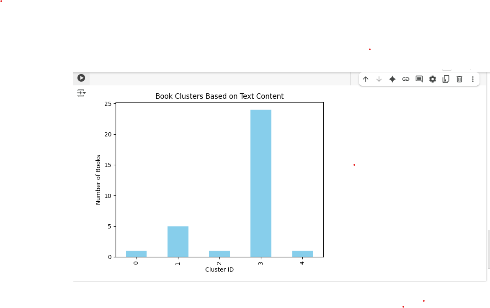

# 📚 AI Book Recommender – SDG 4: Quality Education

This project is an AI-powered book recommender that classifies books based on **what is written**, not **who wrote it**. It uses **Natural Language Processing (NLP)** and **unsupervised machine learning** to recommend the best books fairly — even those by unknown authors.

## 🌍 Aligned UN Goal

**SDG 4: Quality Education**  
> _"Ensure inclusive and equitable quality education and promote lifelong learning opportunities for all."_

This project promotes fair access to great books, helping readers discover valuable knowledge regardless of author popularity.

---

## 🔧 How It Works

1. ✅ Loads a dataset of real books (`cleaned_texts.csv`)
2. ✍️ Processes and vectorizes text using **TF-IDF**
3. 🤖 Clusters books using **KMeans** based on content
4. 📊 Visualizes clusters with a bar chart
5. 📚 Recommends books from the most content-rich clusters

---

## 📁 Files

| File | Description |
|------|-------------|
| `book_recommender.ipynb` | Main Colab notebook (TF-IDF, clustering, plots) |
| `cleaned_texts.csv` | Dataset of books with full text |
| `screenshots/` | Screenshots of output and cluster chart |
| `README.md` | This file |

---

## 🖼️ Screenshots

  
_Books grouped by content using KMeans_

  
_Number of books per cluster_

---

## 🚀 Try It Yourself

You can open and run the notebook in Google Colab:

---

## 🤝 Contributing

Writers from any background can submit books for fair evaluation.  
The future of learning should be based on truth, not fame.

---

## 💡 Author

**K.N. Teresia**  
“To those who seek to see differently.”

